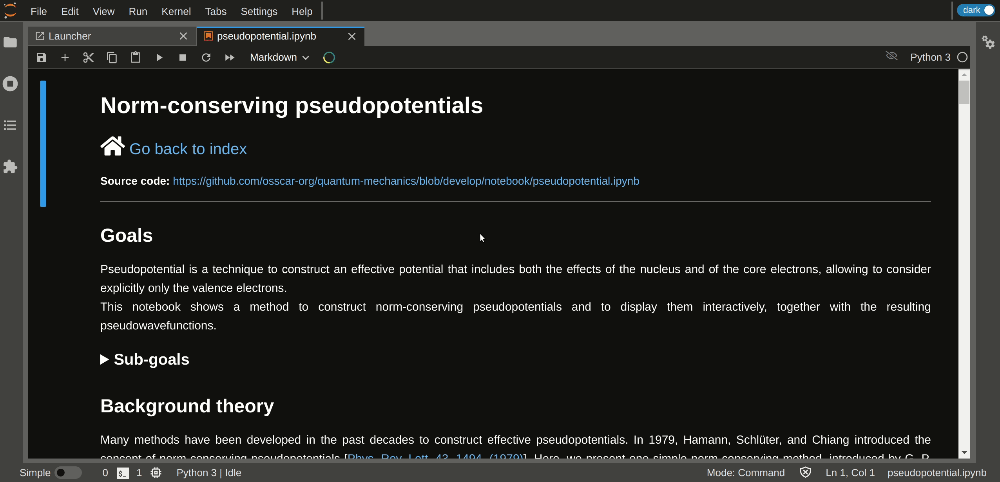

# JupyterLab

## 1. Introduction

JupyterLab is called the next generation of the Jupyter, which has a powerful
graphic user interface (GUI). We use the JupyterLab as the OSSCAR development
environment. 

### a. Installation

JupyterLab can be easily installed by the pip. Otherwise, you can also use the
EPFL <a href="https://noto.epfl.ch">NOTO platform</a>, which offers JupyterLab
as a cloud webpage.

```bash
pip install --upgrade jupyterlab
```

## 2. JupyterLab extensions

JupyterLab allows to develop and install extensions. For the development of the
notebooks, we need to install two JupyterLab extensions.

### a. JupyterLab hide code extension

We developed the "jupyterlab-hide-code" extension, which runs all and hide all 
the code cells of current notebook. It is useful to quickly check the layout of
the output of the notebook. Install it with pip.

```bash
pip install --upgrade jupyterlab-hide-code
```

It is a button with an eye icon on the toolbar of the current notebook. One can
toggle to hide or show the source codes by clicking the button.


### b. Voila extension

The Voila package contains a JupyterLab extension. After installation Voila with
pip, one will have the Voila extension inside the JupyterLab.

```bash
pip install --upgrade voila 
```


